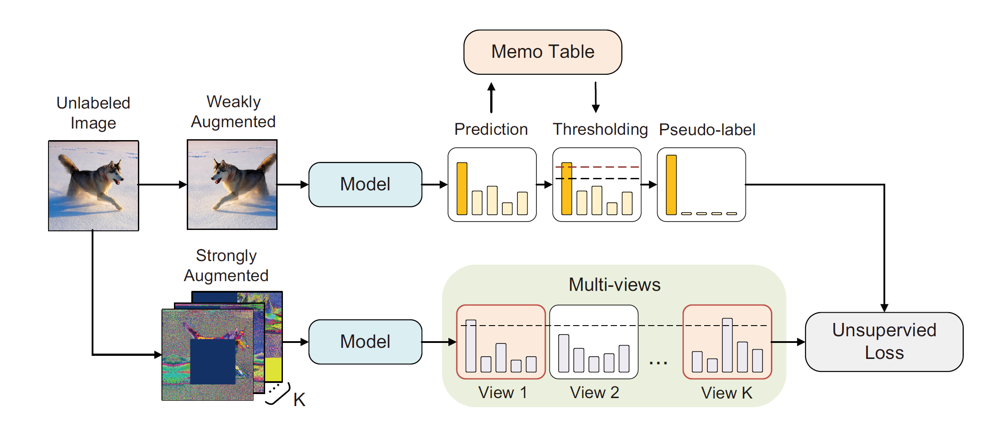

# TeST: Temporal-Stable Thresholding for Semi-supervised Learning

<center>
    
    <br>
    <div style="color:orange; border-bottom: 1px solid #d9d9d9;
    display: inline-block;
    color: #999;
    padding: 2px;">TeST Illustration</div>
</center>


> Semi-supervised learning (SSL) offers an effective method for large-scale data scenes that can utilize large amounts of unlabeled samples. The mainstream SSL approaches use only the criterion of fixed confidence threshold to assess whether the prediction of a sample is of sufficiently high quality to serve as a pseudo-label. However, this simple quality assessment ignores how well the model learns a sample and the uncertainty possessed by that sample itself, failing to fully exploit a large number of correct samples below the confidence threshold. We propose a novel pseudo-label quality assessment method, **TeST** (**Te**mporal-**S**table **T**hresholding), to design the adaptive thresholds for each instance to recall high-quality samples that are more likely to be correct but discarded by a fixed threshold. We first record the predictions of all instances over a continuous time series. Then we calculate the mean and standard deviation of these predictions to reflect the learning status and temporal uncertainty of the samples, respectively, and use to select pseudo-labels dynamically. In addition, we introduce more diverse samples for TeST to be supervised by high-quality pseudo-labels, thus reducing the uncertainty of overall samples. Our method achieves state-of-the-art performance in various SSL benchmarks, including $5.33\%$ and $4.52\%$ accuracy improvements on CIFAR-10 with 40 labels and Mini-ImageNet with 4000 labels, respectively. The ablation study further demonstrates that TeST is capable of extending the high-quality pseudo-labels with more temporal-stable and correct pseudo-labels.

## Requirements

All experiments are done with python 3.7, torch==1.7.1; torchvision==0.8.2

### Prepare environment

1. Create conda virtual environment and activate it.

```sh
conda create -n tst python=3.7 -y
conda activate tst
```

2. Install PyTorch and torchvision following the [official instructions](#https://pytorch.org/).

```
conda install pytorch==1.7.1 torchvision==0.8.2 -c pytorch
```

### Prepare environment

```
git clone https://github.com/Harry887/TeST.git
cd tst
pip install -r requirements.txt
pip install -v -e .  # or "python setup.py develop"
```

## Training

TeST for CIFAR10 with 250 labels

```
python -m torch.distributed.launch --nproc_per_node 4 tst/tools/train_semi.py -d 0-3 -b 64 -f tst/exps/tst/tst_cifar10_dual_exp.py --exp-options  out=outputs/exp/cifar10/250/fixmatch_cifar10_250@5_4x16_tst
```

## Development

pre-commit code check

```
pip install -r requirements-dev.txt
pre-commit install
```
